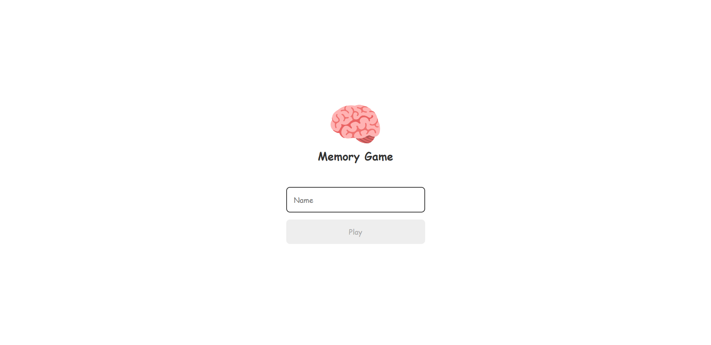
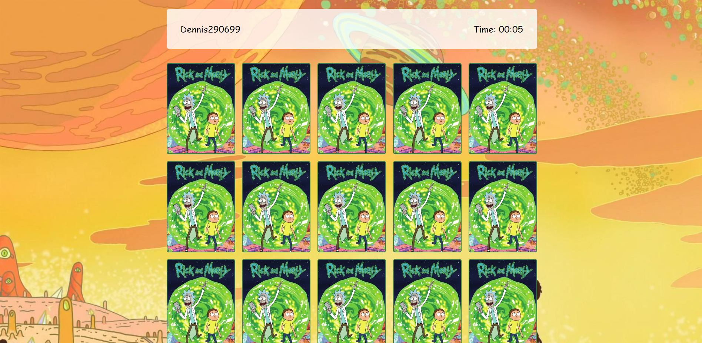
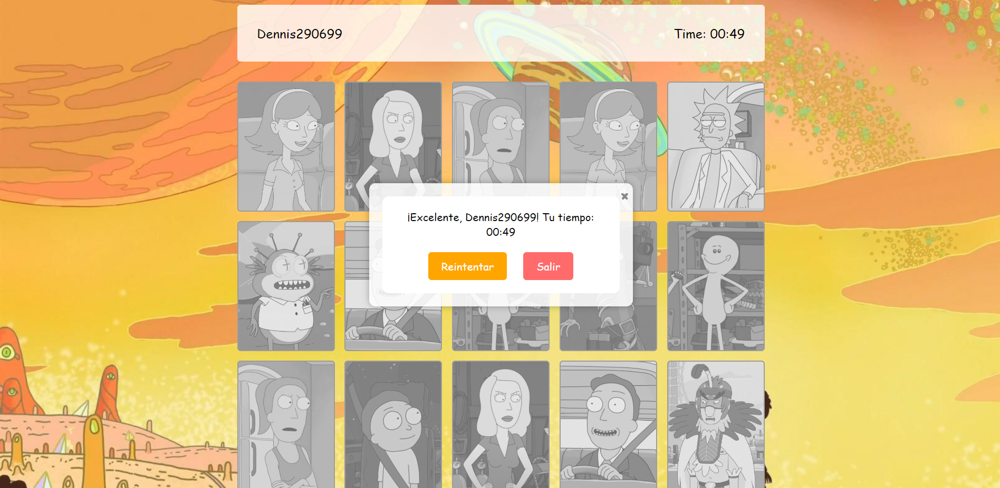

# Memory Game

Memory Game es un juego de memoria simple construido con HTML, CSS y JavaScript. El objetivo del juego es emparejar las cartas con personajes de "Rick and Morty" en el menor tiempo posible.

## Características

- Juego de memoria con temática de "Rick and Morty".
- Registro de nombre de jugador.
- Temporizador para medir el tiempo de juego.
- Modal de finalización del juego con estadísticas.

## Demo

Puedes probar la aplicación en vivo aquí: [Memory Game Demo](https://memory-game-nine-xi.vercel.app/)

## Capturas de Pantalla

## Cómo Jugar

1. Ingrese su nombre y haga clic en "Play" en la página de inicio de sesión.
2. Memorice la ubicación de las cartas con personajes.
3. Haga clic en las cartas para revelarlas y trate de hacer coincidir los pares.
4. El juego termina cuando todas las cartas están emparejadas.
5. ¡Compite para obtener el mejor tiempo!

## Instrucciones de Ejecución

1. Clona este repositorio a tu máquina local.
2. Abre el archivo `index.html` en tu navegador web para jugar.

## Personalización

Si deseas personalizar el juego, puedes hacer lo siguiente:

- Agregar más personajes a la matriz `characters` en `game.js`.
- Cambiar las imágenes de las cartas en la carpeta `/assets/cards/Rick_And_Morty/`.

## Créditos

Este juego utiliza la fuente "Press Start 2P" de Google Fonts.

## Autor

- [Dennis290699](https://github.com/Dennis290699)
## Licencia

Este proyecto está bajo la Licencia MIT. Consulta el archivo [LICENSE](LICENSE) para obtener más detalles.

¡Diviértete jugando el juego de memoria de "Rick and Morty"!
